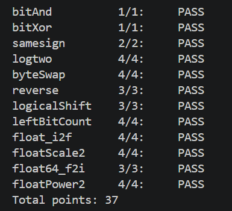

# datalab 报告

姓名：成思儒

学号：2025201822

| 总分 | bitAnd | bitXor | samesign | logtwo | byteSwap | reverse | logicalShift | leftBitCount | float_i2f | floatScale2 | float64_f2i | floatPower2 |
| --- | --- | --- | --- | --- | --- | --- | --- | --- | --- | --- | --- | --- |
| 37.00 | 1.00 | 1.00 | 2.00 | 4.00 | 4.00 | 3.00 | 3.00 | 4.00 | 4.00 | 4.00 | 3.00 | 4.00 |

test 截图：



## 解题报告

### 亮点

1. byteSwap
2. reverse
3. leftBitCount
4. floatScale2

### byteSwap

题目给的 n 和 m 是字节位置，因此实际需要操作的位数要 ×8，用 `<<3` 就能把 n、m 换算成移位量。之后用掩码把要交换的两个字节挖空，再把它们分别推到对方的位置填回去。

以 `x = 0x12345678, n = 1, m = 3` 为例：

- `mask = (0xFF << n*8) | (0xFF << m*8)`，即 `0xFF00FF00`；
- `x & ~mask = 0x00340078`，这是保持不动、最后要保留的部分；
- `((x >> n*8) & 0xFF) << m*8` 把第 n 个字节（0x56）截出来后推到第 m 个字节的位置，反方向同理；
- 最后把三部分用 `|` 拼起来即可。

```c
int byteSwap(int x, int n, int m) {
    int nShift = n << 3;
    int mShift = m << 3;
    int mask = (0xFF << nShift) | (0xFF << mShift);
    int answer = (x & ~mask)
               | (((x >> nShift) & 0xFF) << mShift)
               | (((x >> mShift) & 0xFF) << nShift);
    return answer;
}
```

### reverse

要求把输入的 32 位按位反转，例如 `0xFF0F000F` 要输出 `0xF000F0FF`。

思路像传送带：每一轮从旧的 int 里取最低位（`v & 1`），加到不断左移的新 int 末尾（用 `|` 或 `+` 都可以），同时把旧 int 逻辑右移一位，循环 32 次即可。这样既不需要额外的掩码，也不涉及符号位问题。

```c
unsigned reverse(unsigned v) {
    unsigned reversed = 0;
    int n = 32;
    while (n) {
        reversed = reversed << 1;
        reversed = reversed + (v & 1);
        v = v >> 1;
        n = n - 1;
    }
    return reversed;
}
```

### leftBitCount

要数最左边有多少个连续的 1，可以先对 x 按位取反，于是问题变成“求最高位的 1 的位置 e”，最后用 `32 - e` 得到答案。

这里和 logtwo 有一点小区别：logtwo 不必考虑第 31 位为 1 的情况，而 leftBitCount 必须考虑，所以相当于在二分求位数之后还要再做一次位宽为 1 的检测。

```c
int leftBitCount(int x) {
    x = ~x;
    int num = 0;
    int verify = 0;
    verify = !!(x >> 16); verify = verify << 4; num += verify; x = x >> verify;
    verify = !!(x >> 8);  verify = verify << 3; num += verify; x = x >> verify;
    verify = !!(x >> 4);  verify = verify << 2; num += verify; x = x >> verify;
    verify = !!(x >> 2);  verify = verify << 1; num += verify; x = x >> verify;
    verify = !!(x >> 1);  num += verify;        x = x >> verify;
    verify = !!x;
    num += verify;
    return 32 + (~num) + 1;
}
```

### floatScale2

这题难的关键在于把题读懂：要求返回 `x * 2` 的浮点表示。可行的做法有三种：给原 float 加上它的尾数 m、把阶码 e 加 1、或把尾数 m 左移一位。其中“e 加 1”最方便，但要注意几个边界：

- ±0、NaN、无穷：原样返回；
- 非规格化数（e == 0）：用 `m << 1` 更方便，同时要带符号位；
- 阶码已经到 `0x7F000000`、再 +1 就进入无穷的情况，要直接返回 `s | 0x7F800000`。

```c
unsigned floatScale2(unsigned uf) {
    unsigned e = uf & 0x7F800000;
    unsigned s = uf & 0x80000000;
    if ((uf & 0x7FFFFFFF) == 0) {
        return uf;
    }
    if ((uf & 0x7F800000) == 0x7F800000) {
        return uf;
    }
    if (e == 0) {
        return s | ((uf & 0x7FFFFFFF) << 1);
    }
    if (e == 0x7F000000) {
        return s | 0x7F800000;
    }
    uf = uf + 0x00800000;
    return uf;
}
```

## 反馈/收获/感悟/总结

收获：对浮点数的理解清晰了很多（真的很清晰）。int 转 float 确实很难，更别说 double 了：int 有 31 位有效位，float 的尾数只有 23 位，输入数很大时就需要截断；好在 int 和 float 刚好差 8 位，所以可以先求出 int 的位数，再顶到第 31 位，最后逻辑右移 8 位，同时记得把“个位的 1”去掉。整个过程非常复杂，我借助 AI 和网课才勉强搞懂。

建议：题目的 difficulty 设置不太符合常理，尤其是最后四题——double 转 float 非常难却只有难度 3，而一些比较简单的题（比如 x*2、x^2）却是难度 4。另外，如果能给出一些示例会更好，后四题没有示例，做起来有点像盲人摸象。

## 参考的重要资料

主要参考课程 PPT 与网课讲解；浮点数部分的调试与格式理解借助了 AI 助手。
